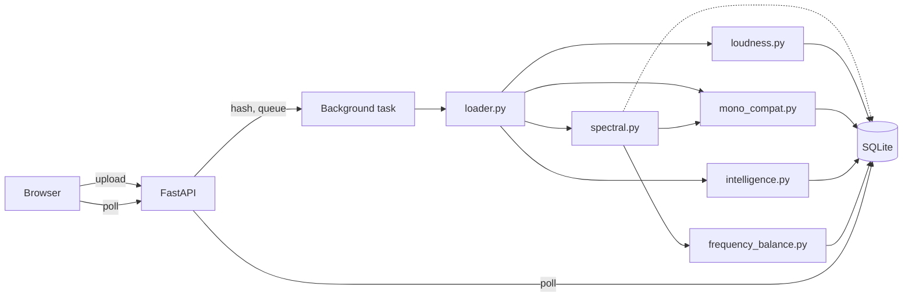

# tracklab

A local-first tool that measures whether a music mix will translate —
whether it holds up on a phone speaker, laptop speakers, earbuds, or a
club system — using measured numbers instead of guesswork.

I produce electronic music. The recurring problem this solves: a mix
that sounds right on studio monitors can fall apart elsewhere, and
there's no way to know which until it's too late to fix cheaply.
tracklab measures the specific things that cause that — phase
cancellation on mono playback, loudness relative to streaming targets,
frequency balance against a reference you choose — and shows the
numbers, not a verdict.

## What it measures

| Measurement | How |
|---|---|
| Frequency balance | Welch's method, implemented from scratch, validated against `scipy.signal.welch` to `rtol=1e-9` |
| Mono compatibility / phase cancellation | Built on the same Welch estimator, from scratch, validated against a first-principles formula (`sin²(φ/2)`) to within 1% |
| Loudness (LUFS) | ITU-R BS.1770, implemented from scratch, validated against `pyloudnorm` and ffmpeg's `ebur128` to within 0.1 LU |
| BPM and key | `librosa` — deliberately a library call, not validated from scratch (see [Why some of this is from scratch and some isn't](#why-some-of-this-is-from-scratch-and-some-isnt)) |

Frequency balance is deliberately *not* compared against invented
"genre reference curves" — there's no rigorous published standard for
that, and fabricating one would have broken the honesty standard the
rest of this project holds itself to. Instead, the same frequency-
balance function runs on any track you designate as a reference, and
the dashboard plots both.

## Architecture



Everything under `backend/audio/` is pure computation: NumPy/SciPy
arrays in, numbers out, no knowledge that HTTP, a database, or a file
on disk exists. `backend/pipeline.py` is the only thing that calls all
of them together. `backend/main.py` is the only HTTP-facing code in
the project. This layering is why every DSP module could be tested
with a few lines of synthetic NumPy data and no server, database, or
real audio file — see `docs/CODE_GUIDE.md` for the full reasoning.

Full stage-by-stage build history: `docs/BUILD_LOG.md`. Deeper theory,
cited against primary sources: `docs/CONCEPTS.md` /
`docs/CONCEPTS.pdf`. The same stages, via annotated real source code:
`docs/CODE_GUIDE.md` / `docs/CODE_GUIDE.pdf`.

## The mathematics, briefly, with validation results

### Frequency balance — Welch's method

A single periodogram (`|FFT|²`) is a statistically noisy estimate of a
signal's power spectral density — more data sharpens frequency
resolution, not the estimate's reliability. Welch (1967) fixed this by
segmenting the signal, windowing each segment, computing a periodogram
per segment, and averaging — trading resolution for reduced variance.

Implemented from scratch in `backend/audio/spectral.py`, including the
periodic (not symmetric) Hann window FFT-based analysis actually needs
— a distinction that surfaced as a real, measured bug during
development (`~2×10⁻⁴` relative error, traced to the wrong window
variant) before being fixed. Validated against `scipy.signal.welch` on
synthetic sine waves and white noise: **`rtol=1e-9`**, effectively
floating-point-limit agreement, not merely "close."

### Loudness — ITU-R BS.1770

Peak level says nothing about perceived loudness over time; RMS
ignores that human hearing doesn't weight all frequencies equally.
LUFS applies frequency weighting (**K-weighting**: a high-shelf plus a
high-pass biquad filter, both derived from the public RBJ Audio EQ
Cookbook formulas) and a **two-stage gate** (an absolute threshold at
−70 LUFS excluding silence, then a relative threshold 10 LU below the
track's own gated average, excluding quiet-by-choice passages) before
averaging.

Implemented from scratch in `backend/audio/loudness.py`. Before writing
any code, `pyloudnorm` and ffmpeg's `ebur128` were run against the same
real track to confirm they agreed with each other at all — they did
(−14.4192 vs −14.4 LUFS), establishing that a 0.1 LU exit criterion was
achievable, not arbitrary. **Validated to within 0.1 LU** against both,
across sine waves, white noise, and deliberate edge cases (near-silence,
heavy limiting, a quiet passage).

### Mono compatibility — phase cancellation as energy loss

Two sine waves at phase difference `φ`, summed and averaged, combine to
`cos(φ/2)` times the original amplitude (a standard trigonometric
identity). Since energy is amplitude squared, the fraction of energy
**lost** on mono-summing is `sin²(φ/2)` — 0% in phase, 50% at 90°, 100%
fully inverted. `backend/audio/mono_compat.py` measures exactly this,
per frequency band, built on the same Welch estimator above.

There is no external library to validate this against, so it's
checked against that formula directly: inject a known phase difference
at a known frequency into a synthetic signal, and confirm the measured
energy loss in the corresponding band matches the prediction.
**Validated to within 1%** across three tested phase differences.
Two real bugs were caught this way during development — spectral
leakage producing a false "worst band," and an unweighted score
diluting a fully-cancelled signal's severity — both documented in full
in `docs/CONCEPTS.md`.

### Why some of this is from scratch and some isn't

The line isn't "maths versus product" — it's whether independently
checkable ground truth exists. Welch, LUFS, and mono/phase all have
one (a reference implementation, a published standard, a constructed
synthetic test). BPM and key detection don't: beat tracking is
genuinely ambiguous even for a human listener (confirmed directly —
this project's own tests hit the textbook "octave error," detecting
exactly half the true tempo on one track), and chroma-based key
detection has a well-known tonic/dominant confusion (also hit directly
on a real track). Reimplementing either would cost real effort for a
validation claim that couldn't honestly be made, so both stay
`librosa` calls.

## Setup

Requires Python 3.13, Node.js, and ffmpeg (`brew install ffmpeg` on
macOS) for MP3/M4A decoding.

```bash
git clone <this repo>
cd tracklab

# Backend
python3 -m venv backend/.venv
backend/.venv/bin/pip install -r requirements.txt
cp .env.example .env   # then set API_KEY to any random string

# Frontend
cd frontend
npm install
cp .env.example .env   # set VITE_API_KEY to the same value as above
cd ..
```

Run the backend:

```bash
backend/.venv/bin/uvicorn backend.main:app --reload
```

Run the frontend, in a separate terminal:

```bash
cd frontend && npm run dev
```

Open `http://localhost:5173`, upload a track, and it'll analyse in the
background — status updates automatically until it completes.

## Running the tests

```bash
backend/.venv/bin/python -m pytest tests/
```

One command, no personal data required — every test uses synthetically
generated audio, not the personal tracks used for manual validation
during development (`data/samples/`, gitignored, never committed).

## Known limitations

- BPM and key detection are library calls with known, expected failure
  modes (above) — not bugs, but worth knowing about before trusting a
  reported key or tempo at face value.
- M4A decoding was never tested against a real file — no M4A sample
  was available during development; WAV and MP3 are both verified.
- No CI pipeline yet — the test suite passes locally but doesn't run
  automatically on push (no GitHub remote was set up during this
  project's timeline; see `docs/BUILD_LOG.md`).
- The shared-secret API key is a proportionate gate for a single-user,
  LAN-exposed tool, not real authentication — don't expose this beyond
  a home network.

## What's next

Genre/mood classification and an LLM-generated feedback layer were
deliberately cut from this first release — see `docs/BUILD_LOG.md`
(2026-08-22) for the full reasoning. Both are planned for after this
freeze, paced across roughly six sessions between October and December
2026.
